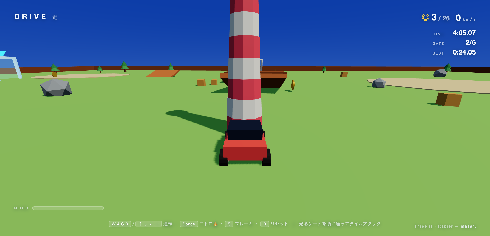

# 🚗 DRIVE — 走

> ローポリの島を小さなクルマで駆けめぐる、物理駆動の 3D プレイグラウンド。

ローポリゴンの島を小さなクルマで探索する、ブラウザで動く 3D ゲームです。光るゲートのサーキットをタイムアタックで走り抜け、ニトロでブーストし、クレートを蹴散らし、島中に散らばったコインを集めます。Three.js による描画と Rapier による物理シミュレーションで構成されています。


🔗 **[Live Demo](https://drive.1qaz.jp)**

---

## 📸 スクリーンショット


| 島を走る | ニトロ 🔥 |
|---|---|
|  |  |

---

## 🎮 操作方法

| 操作 | 動作 |
|---|---|
| **W A S D** / 矢印キー | 走行・ステアリング |
| **Space** | 🔥 ニトロブースト（ゲージ制・回復あり） |
| **S** | ブレーキ・バック |
| **R** | クルマを起こす／スポーン地点へリセット |
| 画面上のボタン | タッチデバイスでは自動表示（ニトロ含む） |

### 遊び方

- **タイムアタック** — 光るゲートを順番にくぐる（次のゲートはビーコンで示される）。スタートゲートを横切るとタイマー開始、再び横切るとラップ完走。ベストラップはローカルに保存される。
- **ニトロ** — Space を長押しすると一気に加速（約 60 → 約 95 km/h）し、排気の炎が出る。ブースト中にゲージが減り、使わないと回復する。
- **コイン集め** — 島に散らばった 26 枚のコインを集めると全クリア演出が発生する。
- **暴れる** — ジャンプ台で飛んだり、積まれたクレートを崩したり、木や岩の間を縫って走る。

---

## ✨ 特徴

- **物理駆動の車両** — 単一のダイナミックシャーシ＋レイキャスト方式のビークルコントローラ（後輪駆動・前輪ステアリング・サスペンション）。低重心と最高速キャップで操作しやすく転倒しにくい設計。
- **ニトロブースト** — 最高速キャップを引き上げ、エンジン出力を倍増させるゲージ制ブースト。
- **タイムアタック** — ゲートを順番に通過してラップを計測。ベストタイムはローカル保存。
- **コイン＆演出** — 距離判定によるコイン収集と、全クリア時のインスタンス化コンフェッティ演出。

---

## 🛠️ 技術スタック

| カテゴリ | 技術 |
|---|---|
| レンダリング | Three.js `0.184`（描画・影・グラデーション天空） |
| 物理 | @dimforge/rapier3d（WASM 物理：ビークル・コライダー） |
| ビルド | Vite（静的出力・バックエンドなし） |

### 仕組み

- **Three.js** がシーンを描画し、各オブジェクトのメッシュはフレームごとに対応する **Rapier** のリジッドボディから駆動される。
- クルマはダイナミックなシャーシコライダーと、レイキャスト式のビークルコントローラで表現。ニトロはキャップを引き上げてエンジン力を倍化する。
- ゲートは純粋に見た目だけのアーチで、順番にくぐることでラップを判定する。コインは単純な距離チェック。演出はインスタンス化されたコンフェッティで描く。

### プロジェクト構成

```
index.html      # canvas + HUD（コイン・速度・ラップタイマー・ニトロ・タッチ操作）
src/
  main.js       # renderer、Rapier 初期化、追従カメラ、コイン、レース＋エフェクト連携
  world.js      # 島：地面・壁・ジャンプ台・クレート・装飾・コイン・ゲート
  car.js        # ビークルコントローラ＋ローポリ車＋ニトロ＋入力 → 力
  race.js       # タイムアタック：ゲート順・ラップタイマー・ベストタイム保存
  fx.js         # インスタンス化コンフェッティ演出
  style.css     # HUD / ローディング / ニトロゲージ / タッチ操作
```

---

## 🚀 セットアップ

```bash
# 依存関係をインストール
npm install

# 開発サーバーを起動
npm run dev      # http://localhost:5173

# 本番ビルド
npm run build    # → dist/
```

---

## ライセンス

[](https://opensource.org/licenses/MIT)

このプロジェクトは **MIT ライセンス** のもとで公開しています。

© 2026 masafykun (https://github.com/masafykun)

---

WebGL シリーズ
[INK](https://github.com/masafykun/ink)、
[VOYAGE](https://github.com/masafykun/voyage)、
[ORB](https://github.com/masafykun/kodou-orb)、
[FLUX](https://github.com/masafykun/yuragi-flux)
とあわせて [masafy](https://github.com/masafykun) が制作。
