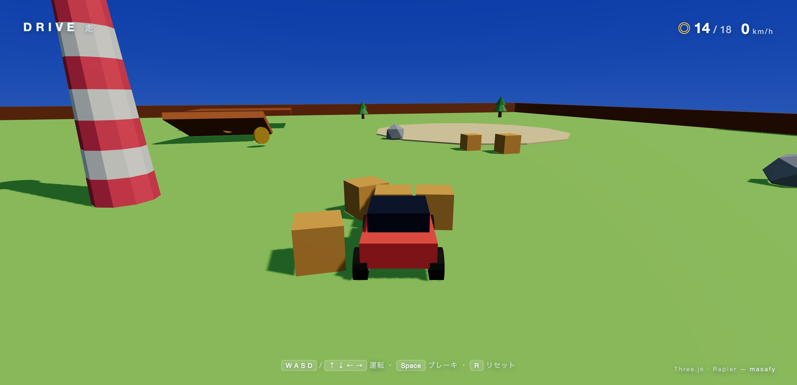
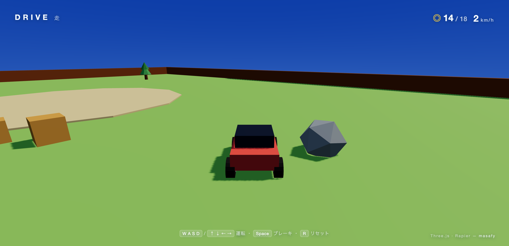

# DRIVE — 走

Explore a low-poly island in a little car. Drive over ramps, scatter crates,
weave between trees and rocks, and collect the coins — a physics-driven 3D
playground in the browser.

**Live:** https://drive.1qaz.jp



---

## Controls

- **W A S D** or **arrow keys** — drive & steer
- **Space** — brake
- **R** — flip the car back / reset to spawn
- On touch devices, on-screen buttons appear automatically.

## What's in the box

- A real ray-cast **vehicle** (Rapier's `DynamicRayCastVehicleController`):
  rear-wheel drive, front-wheel steering, suspension, and a low centre of mass
  so it stays planted instead of tipping over.
- A hand-placed island: ramps to launch off, a stack of **knockable crates**
  (dynamic rigid bodies), trees and rocks to dodge, a candy-striped landmark,
  and 18 spinning coins to collect.
- A smooth **chase camera**, low-poly flat-shaded art, soft shadows, and a
  gradient sky.



## How it works

- **[Three.js](https://threejs.org/)** renders the scene; every object's mesh is
  driven each frame from its **[Rapier](https://rapier.rs/)** rigid body.
- The car is a single dynamic chassis collider plus a vehicle controller that
  ray-casts each wheel against the ground for suspension and traction. Engine
  force, steering angle and brakes are fed in from the keyboard each step.
- A top-speed cap and a deliberately low centre of mass keep it arcade-friendly:
  quick to control, hard to flip.

## Tech stack

- [Three.js](https://threejs.org/) `0.184` — rendering, shadows, gradient sky
- [@dimforge/rapier3d](https://rapier.rs/) — WASM physics (vehicle, colliders)
- [Vite](https://vitejs.dev/) build — static output, no backend

## Project structure

```
index.html      # canvas + HUD (coins, speed, controls, touch buttons)
src/
  main.js       # renderer, Rapier init, chase camera, coins, HUD, loop
  world.js      # the island: ground, walls, ramps, crates, trees, coins
  car.js        # vehicle controller + low-poly car + input → forces
  style.css     # HUD / loading / touch controls
```

## Run locally

```bash
npm install
npm run dev      # http://localhost:5173
npm run build    # → dist/
```

---

Built by [masafy](https://github.com/masafykun), alongside the WebGL series
[INK](https://github.com/masafykun/ink),
[VOYAGE](https://github.com/masafykun/voyage),
[ORB](https://github.com/masafykun/kodou-orb) and
[FLUX](https://github.com/masafykun/yuragi-flux).
